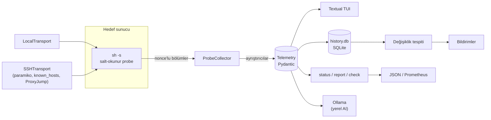

# Mimari

PulseOps tek bir Python paketidir (`pulseops/`). Hedef makinede yalnızca salt-okunur bir POSIX shell betiği
çalışır; tüm ayrıştırma, analiz ve arayüz PulseOps'un çalıştığı tarafta olur.

## Veri akışı



Yerel ve uzak mod **aynı kod yolunu** kullanır: betik yerelde alt süreç, uzakta SSH kanalı üzerinden stdin ile
`sh -s`'e verilir. Böylece iki mod aynı sonucu üretir ve her özellik bir kez yazılır.

## Probe katmanları

`pulseops/collectors/probe.py` betiği bölümlerden oluşturur. Her çalıştırmada rastgele bir nonce bölüm
işaretlerine eklenir; komut çıktısı (ör. bir log satırı) sahte bölüm enjekte edemez. `LC_ALL=C` ile çıktılar
dilden bağımsızdır, `exec 2>/dev/null` ile hata çıktısı atılır.

| Katman | Sıklık | İçerik |
| :--- | :--- | :--- |
| BASELINE | yalnızca ilk tur | oranlar için kısa bir ilk örnek (tek seferlik `status` de gerçek CPU gösterir) |
| FAST | 2 sn | `/proc` dosyaları kabuk yerleşikleriyle (fork'suz), `ss -lntu`, tüm süreçler için tek `awk`; **sudo asla** |
| SLOW | 30 sn | host, diskler, port sahipleri, nginx, timer/cron, yedekler, docker (+ güvenlik), depolama, güvenlik duvarı, servisler, sshd, fail2ban, SSH aktivitesi, hesaplar, yetki |
| RARE | 10 dk | unit dosyaları, `getconf`, paket güncellemeleri, sertleştirme |
| LOGS | Loglar sekmesi açıkken | nginx access log veya journald |

Etkileşimli görünümlerde (TUI, filo) paket güncellemesi kontrolü ilk turdan sonraya bırakılır; ekran ~1 sn'de
dolar. `sudo` yalnızca root olmayan kullanıcıda, parolasız çalıştığı bir kez tespit edildikten sonra ve yalnızca
yavaş katmanda `sudo -n` ile kullanılır (her çağrı auth log'a yazıldığı için hızlı katmanda asla).

## Paket yapısı

```
pulseops/
├── cli.py              giriş noktası: TUI argümanları, yapılandırma, alt komut yönlendirmesi
├── commands.py         status, report, check (+CheckResult), history, notify, config, probe, fleet, ai
├── config.py           Pydantic yapılandırma modelleri, TOML yükleme, şablon
├── history.py          HistoryStore (SQLite): örnekler, baseline, değişiklikler, tüketici imleçleri
├── notify.py           Telegram / Slack / Discord / e-posta / webhook, kanal başına kaçışlama
├── exporters.py        Prometheus metin biçimi, atomik dosya yazımı
├── scheduler.py        systemd service + timer üretimi
├── ai.py               Ollama istemcisi, bağlam özeti, maskeleme, konuşma, çıktı temizleme
├── installer.py        version / update / uninstall, kurulum türü tespiti
├── logging_setup.py    ~/.cache/pulseops/pulseops.log (döndürmeli)
├── collectors/
│   ├── probe.py              betik ve bölüm ayrıştırma
│   ├── probe_parsers.py      saf (I/O'suz) ayrıştırıcılar: /proc, df, ss, güvenlik duvarı, SOC, güncellemeler, sertleştirme, docker
│   ├── probe_collector.py    ProbeCollector: oranlar (hedefin /proc/uptime farkıyla), katman önbellekleri
│   ├── transport.py          LocalTransport, SSHTransport (~/.ssh/config, ProxyJump, yeniden bağlanma)
│   ├── hostkeys.py           OpenSSH StrictHostKeyChecking semantiği
│   ├── drift.py              güvenlik parmak izi ve fark (HIGH / MEDIUM / INFO)
│   ├── audit_exporter.py     sağlık skoru, Markdown rapor, eylem planı
│   ├── telemetry.py          collect_telemetry, summarize_alerts
│   ├── security_collector.py sshd ayrıştırma, güvenlik özeti ve tavsiyeler
│   ├── nginx_parser.py, port_collector.py, service_collector.py, backup_collector.py,
│   │   storage_collector.py, docker_collector.py, db_collector.py, http_health.py, ssl_checker.py
│   ├── base.py               BaseCollector.collect(include_slow, include_logs) -> Telemetry
│   └── mock_collector.py     --demo verileri
├── models/             Pydantic v2: Telemetry, SystemSnapshot, ListeningPort, ProxyRoute, ServiceUnit,
│                       SecurityOverview (+ UpdateStatus, HardeningAudit, AccessAudit…), ContainerSummary
│                       (+ ContainerSecurity), StorageOverview, BackupData, PrivilegeInfo
└── ui/
    ├── app.py          ServerTUIApp: thread worker ile toplama, apply_telemetry, sekmeler, kısayollar
    ├── fleet_app.py    FleetApp: çoklu sunucu tablosu
    ├── widgets/        sekme panelleri (her biri kaydırılabilir bir VerticalScroll içinde)
    ├── modals/         uyarılar, geçmiş, AI, yapılandırma görüntüleyici, boş port bulucu
    ├── safe.py         PlainTable: hücreler hiçbir zaman markup olarak yorumlanmaz
    ├── ascii_filter.py --ascii için genişlik korumalı karakter dönüşümü
    └── styles.tcss     tek stil dosyası (paket verisi ve PyInstaller ile dağıtılır)
```

Depo kökünde ayrıca: `install.sh` (kurulum betiği; genel URL'si sabit kalsın diye kökte), `packaging/` (nfpm
yapılandırması, örnek config, PyInstaller giriş betiği), `scripts/` (Windows ve derleme yardımcıları), `tests/`.

## Önemli tasarım kararları

- **Arayüz hiç beklemez:** toplama bir thread worker'da yürür; önceki tur bitmeden yenisi başlamaz. Hata
  durumunda son veri ekranda kalır, header'da bağlantı uyarısı çıkar, ayrıntı log dosyasına yazılır.
- **Oranlar ağ gecikmesinden bağımsız:** CPU, süreç CPU'su, ağ ve disk I/O hızları hedefin `/proc/uptime`
  farkıyla hesaplanır; SSH gecikmesi sonuçları bozmaz.
- **Bilinmeyen ≠ güvenli:** okunamayan güvenlik duvarı, sshd, sudoers, paket önbelleği vb. "bilinmiyor"
  olarak modellenir (`known` bayrakları, `None` değerler); uyarı, skor, değişiklik tespiti ve AI özetinde ayrı
  ele alınır.
- **Gözlemciden bağımsız değişiklik tespiti:** portlar sahip süreç adı olmadan karşılaştırılır, okunamayan
  kategoriler karşılaştırılmaz, makine kimliği `/etc/machine-id`'dir; aynı makineyi root ve normal kullanıcıyla
  veya farklı yollardan izlemek sahte alarm üretmez.
- **Güvenilmez veri:** sunucudan gelen her metin düz metin olarak gösterilir; ayrıştırıcılar fuzzing ile
  sınanır. Ayrıntılar: [Güvenlik Modeli](security.md).
